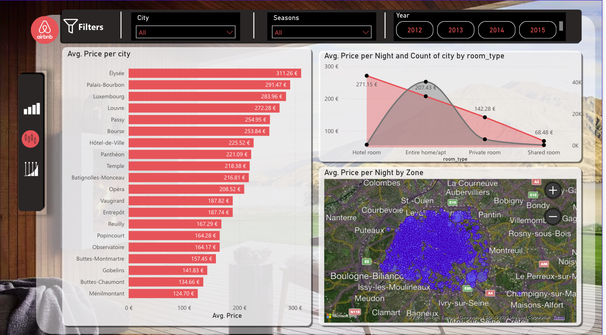
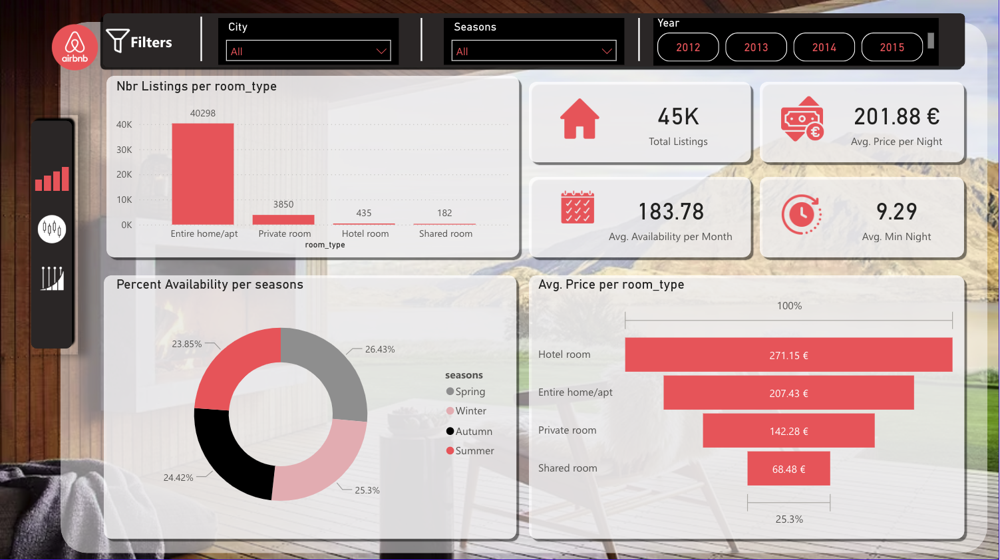

# 🏡 Airbnb Paris — Market Analytics & Business Intelligence Dashboard

> Pipeline complet de préparation de données en Python et tableau de bord décisionnel interactif sous Power BI pour l'analyse du marché locatif de courte durée à Paris intra-muros.

---

## 📸 Aperçu du Tableau de Bord

### Page d'Accueil Interactive


### Vue d'Ensemble & Disponibilités


### Analyse Géographique & Niveaux de Prix


---

## 🎯 Contexte & Enjeux Métier
Le marché parisien de la location courte durée présente une forte hétérogénéité spatiale et saisonnière. L'objectif de ce projet est de modéliser les annonces de la capitale pour :
- **Mesurer les volumes et la typologie des offres** (prédominance des logements entiers vs chambres partagées).
- **Cartographier la dispersion tarifaire** à travers les arrondissements parisiens et évaluer les primes de centralité.
- **Identifier l'impact de la saisonnalité** sur la disponibilité moyenne et les tarifs à la nuitée.
- **Croiser les dynamiques d'attractivité** avec des données contextuelles enrichies (météo et événements parisiens).

---

## 🛠️ Stack Technique
- **Traitement & Ingestion :** Python (Pandas, NumPy, Scikit-learn, Seaborn, Matplotlib)
- **Modélisation & BI :** Microsoft Power BI (Power Query, DAX, Cartographie ArcGIS/Bing Maps, Thème UI personnalisé)
- **Environnement :** Jupyter Notebook (`Nettoyage_data.ipynb`)

---

## 🔄 Pipeline de Données (Python & Feature Engineering)
Le notebook documente les étapes de nettoyage et d'enrichissement appliquées aux données sources d'Inside Airbnb :
1. **Dédoublonnage et filtrage :** élimination des entrées sans prix ou sans localisation précise.
2. **Normalisation monétaire :** conversion des chaînes monétaires brutes (`$`, virgules) en valeurs numériques flottantes.
3. **Imputation ciblée :** traitement des valeurs manquantes (`reviews_per_month` à 0, valeurs médianes pour `bathrooms`, `bedrooms`, `beds`).
4. **Encodage catégoriel :** encodage numérique des arrondissements (`LabelEncoder`) pour faciliter les modélisations.
5. **Feature Engineering temporel :** attribution déterministe de la saison (`Hiver`, `Printemps`, `Été`, `Automne`) selon la date de réservation.
6. **Enrichissement de contexte :** génération de tables croisées simulées pour la météo parisienne (`weather.csv`) et le calendrier événementiel (`events.csv`).

---

## 📊 Fonctionnalités du Rapport Power BI
- **Navigation applicative ergonomique :** menu d'accueil avec boutons interactifs pour basculer entre la vue générale, les métriques statistiques et les événements.
- **Barre de filtrage multidimensionnelle :** filtres synchronisés en haut de page permettant de croiser simultanément les arrondissements (*City*), les saisons (*Seasons*) et les années de publication (*Year* : 2012–2015).
- **Cartes KPIs globales :**
  - Volume total d'annonces : **45K listings**
  - Prix moyen à la nuitée : **201,88 €**
  - Disponibilité moyenne mensuelle : **183,78 jours**
  - Séjour minimum moyen : **9,29 nuits**
- **Cartographie par zone :** carte interactive de Paris intra-muros mettant en valeur la concentration géographique des annonces et les corridors tarifaires.
- **Entonnoir de prix par typologie :** comparaison hiérarchique des coûts moyens selon le format d'hébergement :
  - *Hotel room* : **271,15 €**
  - *Entire home/apt* : **207,43 €**
  - *Private room* : **142,28 €**
  - *Shared room* : **68,48 €**
- **Classement par arrondissement :** palmarès des prix moyens dominé par les quartiers historiques (Élysée à **311,26 €**, Palais-Bourbon à **291,47 €**, Luxembourg à **283,96 €** vs Ménilmontant à **124,70 €**).

---

## 💡 Insights Clés
- **Polarisation géographique :** les arrondissements centraux et de l'ouest parisien (7e, 8e, 6e, 1er) affichent des tarifs moyens supérieurs de plus de 140 % aux quartiers périphériques du nord-est (19e, 20e).
- **Monoculture du logement entier :** les appartements complets constituent l'écrasante majorité du parc locatif (plus de 40 000 annonces sur les 45 000 recensées).
- **Stabilité de la disponibilité saisonnière :** une distribution équilibrée des disponibilités tout au long de l'année (Printemps : 26,4 %, Hiver : 25,3 %, Automne : 24,4 %, Été : 23,8 %).

---

### 🔗 Accès au Rapport
- **Consulter le rapport interactif en ligne :** [Lien vers le rapport Power BI](https://app.powerbi.com/groups/me/reports/62cb6eb5-1725-4434-bbc1-cef66de8964a/de2f6777deea833daaa4?redirectedFromSignup=1&experience=power-bi)

## 📂 Structure du Répertoire
```text
├── README.md                 # Synthèse et documentation du projet
├── Airbnb_final.pbix         # Rapport Power BI interactif
├── Nettoyage_data.ipynb      # Notebook Python de nettoyage et EDA
├── datasets/                 # Données sources et exports nettoyés (.csv)
└── assets/                   # Captures d'écran et ressources visuelles
    ├── home_page.png
    ├── general_view.png
    ├── market_insights.png
    └── icons/